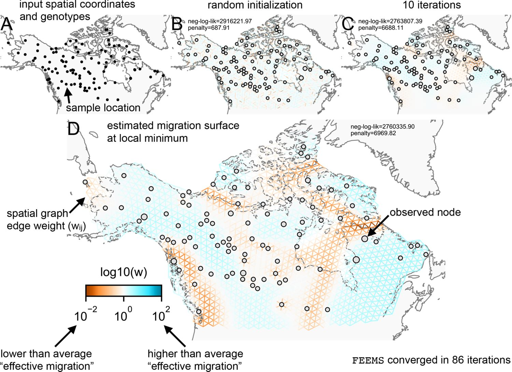

# Lab 11

## TESS3 - structure and selection in space

Today, we'll run through some `TESS3r` analyses in grey wolves. The goal is to identify if there is significant population structure, and where that structure is distributed across space. Finally, we'll take a look at what loci show strong differentiation between populations.

### Importing data, installing packages

You'll need to install a few new packages here. Central to the analysis is `tess3r`, but the data we'll be reading in today I've processed for you using several other packages. Originally, the data comes as `.tped` format, which I had to convert to an `.lfmm` format. Be glad you didn't have to, but if you want to really see how this kind of process goes, try! I've included the .tped file in the repository, do with it what you will.

```{r}

#you need devtools installed for this, if the line below crashes first try `install.packages("devtools")`
# If you are on WSL,this might give you loads of errors and take a while. You'll likely need to install many packages in WSL before you can get devtools compiled - the list of these depends on your installation, but just read the errors carefully - there will be a command for the package you are missing.

devtools::install_github("bcm-uga/TESS3_encho_sen")
```

The data I have included for you this week comes from [@Schweizer2016], and contains 94 individual sequences of grey wolves across north america. We first read in the coordinates of each sample and then the genotypes, here formatted almost exactly like the `GT` matrices you have dealt with before, but just transposed (instead of each row being a variant, and each column being an individual, each row is an individual and each column is a variant).

```{r}
library(tess3r)
library(readr)
library(maps)

samples_table = read_csv("data/nacanids.csv")
#Quick visualization
plot(samples_table$Long,samples_table$Lat,pch=16)
map(add=T,interior=F)
geno = as.matrix(read.table("data/nacanids.lfmm"))
```

Now we can run the `TESS3` analysis. Recall this is quite similar to `ADMIXTURE`, but includes a spatial component. So, we need to specify the numbers of $K$ (ancestries) it will attempt to examine.

```{r}
coords = as.matrix(samples_table[,2:3])
tess3_res = tess3(X=geno,coord=coords,K=1:8,method="projected.ls",ploidy=2,openMP.core.num=4)
```

Nominally, you can now use a cross-validation plot to try and identify a minimum/plateau value of number of populations. In practice, I've found this kind of data shows no clear cross-validation choice except for some rare circumstances. For today, pick a $K$ (above 1 and below 8) and do the rest of the analyses assuming that many populations.

You can plot the admixture proportions, for instance, as follows

```{r}
your_K = ???
ancestry_matrix =  qmatrix(tess3_res,K=your_K)
ancestry_barplot = barplot(ancestry_matrix,border=NA,space=0,xlab="Ind",ylab="Ancestry")
```

This utility plot is included with `tess3r` and is essentially just a barplot, but adds the nice bit of sorting individuals by their ancestries.

We can next visualize how these ancestries are distributed across space. You will need the `terra` package for this to work (well, `raster`, but `raster` is now just a wrapper around `terra`), which will require you to install further, other packages in WSL/macOS depending on where you run the code. Follow their instructions [here](https://github.com/rspatial/terra).

```{r}
area_plot = plot(ancestry_matrix,coords,method="map.max",interpol=FieldsKrigModel(10))
```

This will be part of your submission for this week. If you chose a $K$ value larger than 3, you are probably scratching your head a little bit at this plot. Remember that choosing the right $K$ is a bit of an art - populations are often hierarchically nested. That being said - which ancestry looks to be most range limited? What environment does that seem to correlate with (pull up google maps here). One thing that might help you interpret your results - even though `tess3` takes spatial coordinates into account, it does not take into account anything about what is in that space. So, to your human eyes two samples across the Hudson Bay are essentially isolated, but to TESS they are whatever "as the crow flies" distance apart. A different (sometimes better) approach is something like `FEEMS`, but since it's heavy in `python` I won't make you run through that code, but you can find it [here](https://github.com/NovembreLab/feems), and we are using their example data.

## Selection scans

The selection scan analysis is in principle already done, just contained within the `tess3_res` object you created. You'll need to extract the p-values per SNP first, and then do some extra bits.

```{r}
pvals = pvalue(tess3_res,K=your_K)
manhattanesque_plot = plot(pvals,pch=".",xlab="SNP Index",ylab="-log10(pvalue)")
```

Which of these points are significant? Well, there are tons that are much lower than 0.05, but that's what you'd expect with lots of points. In fact, if we look at their overall distribution, if there is no signal it should look pretty flat:

```{r}
hist(pvals,xlab="p-value")
```

If the histogram is not flat (ignore values close to 0 and 1) - there's probably some funky business to your signal as is. But we can still be extra conservative and pull out the most likely candidates for selection using some form of false discovery rate correction. I like Bonferroni - multiply by total tests done and then pick a signifance level (say, 0.05), but you could do some other form of FDR correction - read more about those methods [here](https://en.wikipedia.org/wiki/False_discovery_rate).

```{r}
sig_vals = which(pvals*length(pvals) < 0.05)
plot(pvals,pch=".",xlab="SNP Index",ylab="-log10(pvalue)")
points(sig_vals,-log10(pvals)[sig_vals],pch=".",cex=5,col="red")
```

Now, to actually get info on what is *at* these significant (if any) SNPs, you'd need to get their locations out from the `.map` file that is produced by plink, the `.lfmm` format does not contain information about genetic location. These SNPs are ones that show significant differentiation between your groups - they are essentially identifiers of the different ancestries. How does the number of these outliers seem to square with the number of groups you chose?

## Spoilers - wait until you do the rest of the analyses to read here.

Once you're done, I want you to go back and think about this analysis again. The idea is that *there is* some sort of spatial structure, which definitely makes sense for a broadly distributed species. But, if you run the broken-stick method to lok for significant PCs in the genotypes here, you will find - 1. Remember that $K$ = $# of PCs -1$. So, the data here essentially supports no structure whatsoever (how to interpret $K=0$ is a bit of a mystery to most people - it can be a data error, but more broadly suggests that there just isn't structure that looks like a Hardy-Weinberg population).

This is all to point out that some data-sets just don't behave in ways that we wish they would. There definitely is *some* structuring in this population, but it may not be best described by models like `tess3` or `ADMIXTURE`. `FEEMS`, for instance, finds this:



Here, thee blue areas show high migration, while red show low. Try to interpret what you found with `tess3` given the above patterns in migration. Do the patterns line up? Where *is* migration taking place?