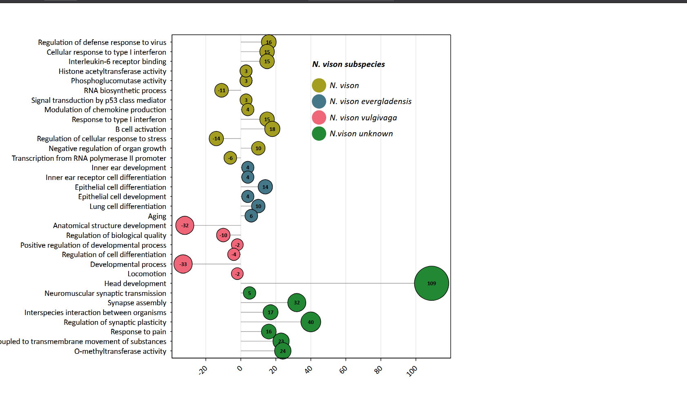
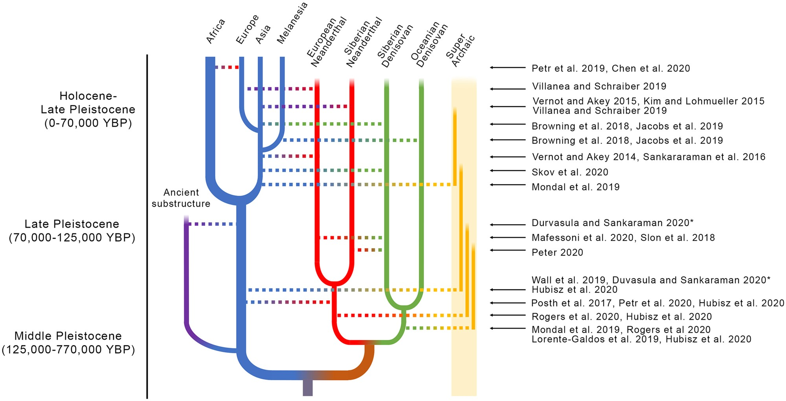
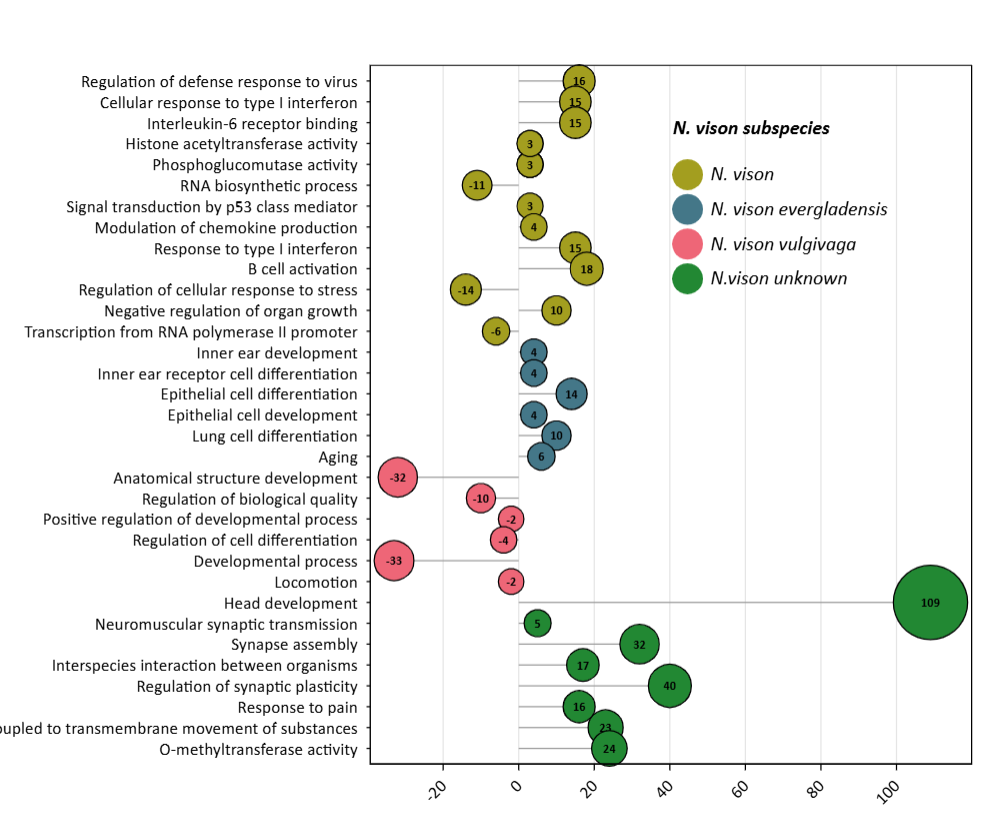
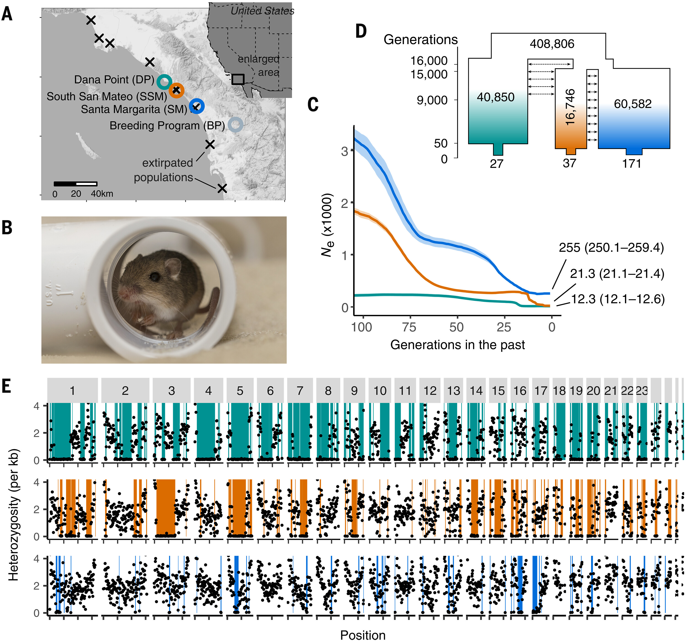
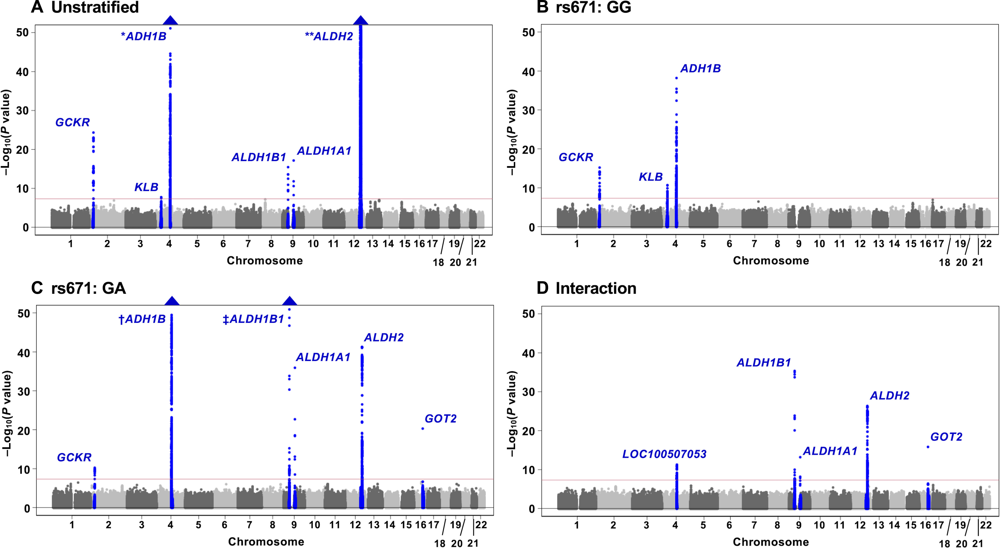

## Figure critiques.

Step 1: send me your chosen figures on slack.

. . .

Hop onto the class website and find this discussion, linked in week 12.

. . .

We'll have a few minutes for each group to discuss each figure in each group, and then we'll go back to a broader group discussion about the figure. We'll follow a reverse feedback approach:

1\) Explain what you see in the figure. What conclusions can you draw about the data?

2\) What aspects of the figure did you struggle to understand?

3\) Aesthetically - what could be improved about the figure?

. . .

We'll then have the person who chose the figure describe what it's supposed to show.

## Figure 1

{width="828"}

## Figure 2

{width="767"}

## Figure 3

## Figure 4

## Figure 5

{width="925"}

## Figure 6
