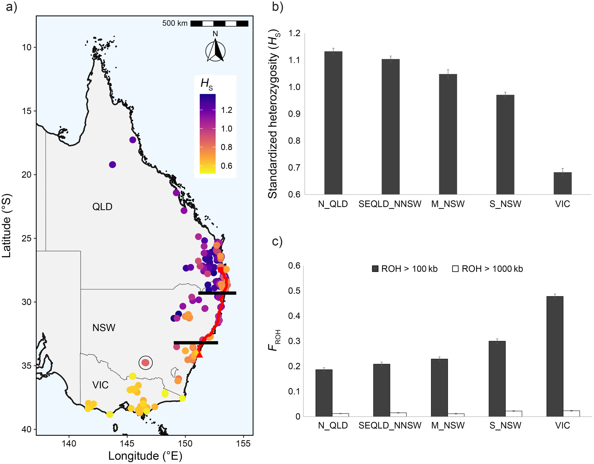
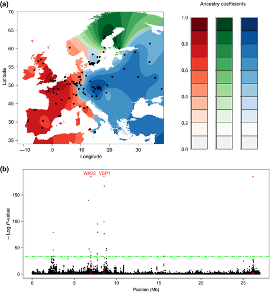
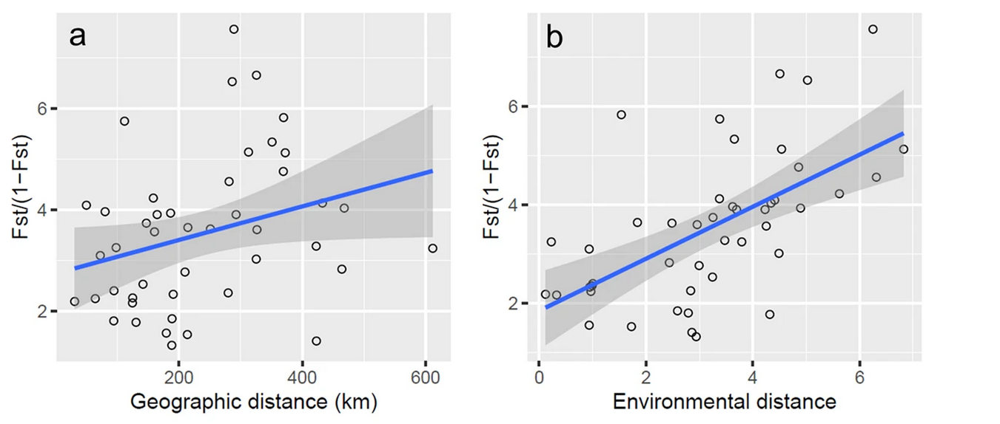
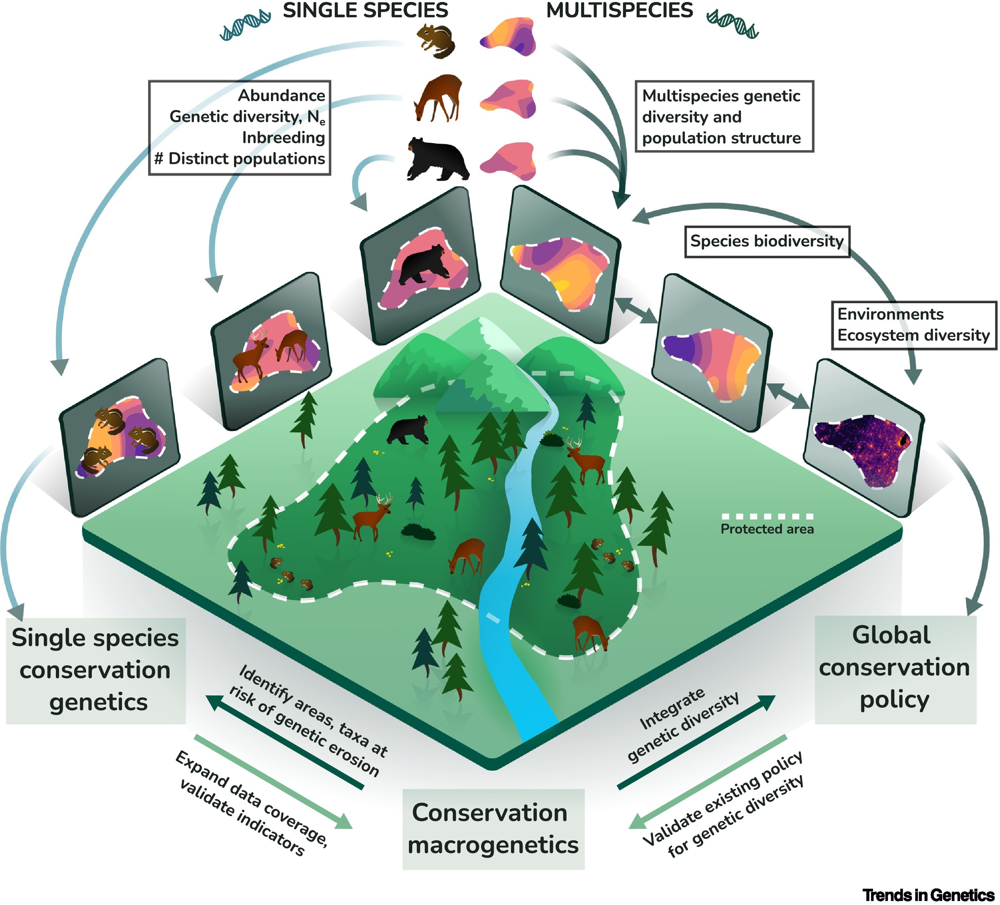

## Student's Choice 1: Conservation Genomics

One of the most rapidly changing fields within population genetics is Conservation Genomics.

. . .

There are three major axes of development here:

-   How can population genetics help inform what we *should* conserve.

-   How can population genetics help us in conservation efforts.

-   How can population genetics predict what *will* need to be conserved?

## Some basic history {.smaller}

Conservation genetics traces its history back to some core developments in population genetics - Ohta, Kimura and Neutral Theory.

. . .

Early recognition of the negative feedback loop that evolution poses for threatened species - reduced population size lead to both reduced adaptability AND increased inbreeding, decreasing fitness further.

. . .

A recognition that even if populations are kept above some Allee effect level - evolution may lead to their extinction nonetheless.

. . .

Early focus in quantifying genetic diversity (also a driver for many sequencing approaches in latter half of 20th century)

## Early efforts - $N_E$ and not much else

Early approaches focused on identifying heterozygosity and the implied effective population size.

. . .

The idea was rather simple - bigger effective population sizes should be more adaptable and less likely to show inbreeding, etc.

. . .

Why is $N_E$ not the best predictor of adaptability?

## Mutational meltdown {.smaller}

In a classic paper Lynch et al showed how the ecological parameters of a population (carrying capacity and reproductive rate) directly tied to its long term $N_E$ and, in turn, extinction probability.

. . .

Populations with low reproductive rates or low carrying capacities rapidly accumulated deleterious mutations that selection was simply ineffective in removing from the population.

. . .

This would lead to even slower reproduction - increased mutation accumulation, and continuing collapse of the population.

## Pygmy Possums

```{julia}
using Plots, Measures, LaTeXStrings, CSV, DataFrames
theme(:dracula)
default(dpi=400,xlabelfontsize=16,ylabelfontsize=16,markerstrokewidth=0)

mars_data = CSV.read("data/possum_data.csv",DataFrame,header=false)

possum_plot = scatter(floor.(mars_data.Column1),floor.(mars_data.Column2),leg=false,xlabel="Year",ylabel="Population Size")
```

## Introduction of males from outbred population

```{julia}
plot!(possum_plot,[2011,2011],[90,60],arrow=true)
plot!(possum_plot,[2014,2014],[150,124],arrow=true,col=1)
```

## Is inbreeding always fatal?

Recall that inbreeding can temporarily expose previously unseen recessive deleterious variants to selection, but, long run, can lead to the purging of these variants.

. . .

Island foxes off the coast of California, for instance, show high levels of inbreeding but no associated fitness decrease.

. . .

Similarly, elephant seals show low heterozygosity but no apparent demographic issues.

. . .

The key is that these populations have maintained low sizes/high inbreeding over long periods of time - they are not shrinking due to new changes in environment.

## Adaptability - what is it?

Adaptability is generally measured as the $V_A$ (additive genetic variance) for fitness relevant traits in a population.

. . .

In practice, this is hard to measure because we often don't know what the relevant genetic diversity is.

. . .

We know for sure that $V_A << V_G$, where $V_G$ is total genetic variation for all traits.

. . .

So, estimates of $\theta$ - $S$, $H$, $\pi$ are all at least linearly related to the upper boundaries for $V_A$.

## First steps - measure diversity

The first step for any conservation study is therefore to look for genetic diversity.

. . .

Historically, a few marker genes, especially mitochondrial have been used here.

. . .

What is the expected heterozygosity for mtDNA versus autosomal genes?

. . .

Why not just use nuclear markers?

## More modern approaches {.smaller}

Recognizing that the costs of sequencing full genomes are likely too high to efficiently sample large populations, and that individual markers were potentially inaccurate, multiple axes developed.

. . .

metagenomics - identify all microbial species in a community (looking for community health, diversity, etc.) by sequencing all DNA from a sample.

. . .

eDNA - sample environmental DNA, identify sequences belonging to different species, ideally also identify diversity within species.

. . .

RADseq/PoolSeq - either reduce the proportion of genome you sequence, or sequence to a low coverage but many samples together. Loses info on LD, but heterozygosity well estimated at many sites.

## Where is the genetic diversity?

One stronger point of recognition in the last decade is that not all genetic diversity is made equal.

. . .

Say you have a species with, on average, high heterozygosity (say 0.1). Does this mean that it is not threatened?

. . .

It could be that *some* parts of its range are threatened, while others are not. How these patterns inter-relate may not be the way you expect - see Koalas.

## Koala genetic diversity

{width="781"}

## More details

Southern Victoria populations all descended from relatively few survivors of large scale hunting.

. . .

Populations protected, and therefore quite large now, but have barely any genetic diversity.

. . .

Northern range expected to see more change due to climate/urbanization. Should we protect them more?

## Geographic distribution of genetic diversity

One way to measure how diversity is distributed in your own data is to just look at genetic diversity across space.

. . .

This will show you what parts of the range might have lower genetic diversity, or be reservoirs for adaptability.

. . .

But, what can create an illusion of increased genetic diversity, from the processes we've looked at?

## What are the conservation units?

When we think about species conservation, we think about... species

. . .

But, populations may be distinct in ways that warrant their conservation as subspecies/diverse variants.

. . .

This is similar to the issue of estimating population structure - are there sub-populations in your species.

. . .

We may want to protect all subpopulations, or only some. In practice - can't protect everything, so what do you focus on?

. . .

More importantly, can we even tell species apart?

## Multi-species coalescent and testing species identity

One common approach to identifying species as groups of separately evolving organisms has its roots in coalescent theory.

. . .

Multi-species coalescent approaches are baked-in to many systematic approaches and phylogenetic software.

. . .

The idea is that even with multiple species, some topology variation will be observed due to ILS.

. . .

But, one can in principle decide whether samples come from the same or different species by looking at the distribution of coalescent times.

. . .

See blackboard.

## Problems with multispecies coalescent

MS-coalescent approaches may sometimes oversplit.

. . .

If you don't sample evenly across space, discontinuities in coalescent distributions naturally emerge.

. . .

Similarly, if you sample well, but recent change has fractured a broad landscape, discontinuities can again appear.

. . .

For true "species" - you need evidence of reproductive incompatibility.

. . .

How can we obtain evidence of RI?

## TESS - identifying structure and selection



## TESS cntd. {.smaller}

You can then focus on managing unique variants that may be important for local adaptation, rather than all variation in each population.

. . .

Locally adapted alleles may be important in a variety of contexts:

-   Locally adapted variation could be threatened (e.g. high alpine adaptation in flowers)

-   Locally adapted alleles could be key to rescuing other populations from change (e.g. warm water adaptation in corals).

. . .

What other process we've talked about might change whether locally adapted variants need to be protected or not?

## Population connectivity

Migration can introduce genetic variation even in low genetic variation habitats, and so adaptability not easily measured linearly through heterozygosity.

. . .

Two different quantities - historic migration (likely leading to higher current heterozygosity) and potential for migration.

. . .

Especially relevant for passive dispersal - if ocean currents change direction, connectivity will also change for corals, might not change as much for whales.

. . .

Estimating historic migration in context of landscape - ideas primarily from clinal theory.

## Isolation by Distance {.smaller}

In very rough approximation, we expect $F_{ST}$ between two populations to be impacted by their relative migration rates:

$$
F_{ST} \approx \frac{1}{1+4Nm}
$$

```{julia}
dist = range(4,6,length=50)
nms = 100 .*exp.(-dist)
fst = 1 ./ (1 .+ 4 .* nms)
plot(dist,fst ./(1 .-fst),xlabel="Distance (miles)",ylabel=L"\frac{F_{ST}}{1-F_{ST}}",leg=false)
```

## But, not always quite linear {.smaller}

If there are barriers to dispersal, divergence may be better explained by environmental rather than physical distance.

. . .

The two are, in practice, correlated, so need to be co-estimated.

. . .



## The poor sad no good population

Suppose you have identified a population that shows low connectivity, high divergence, low population size, low heterozygosity but little to no clear local adaptation.

. . .

Do you preserve it?

. . .

It *is* unique, in a way. And if it has existed a while, it could be uniquely adapted to being threatened (purged deleterious variants, for instance).

. . .

Identifying conservation units is just the first step - real policy rarely affected solely by good science. If this population is easier to preserve (local legislators more willing to protect it, available funding, long term prospects) - it might be a better candidate to preserve than a healthy thriving population that will no longer be such after new ML data-center is built.

## Connecting the right populations at the right times

One way to define conservation units is to holistically examine not only general genetic diversity and similarly, but also to examine similarity at outlier sites.

. . .

Rescuing one alpine population may be better done with a second alpine population rather than a nearby, larger, valley adapted plant.

## The converse - when can we stop worrying {.smaller}

It's probably clear that there are more factors that can influence whether a population is in trouble than effective population size alone.

. . .

You could ask, however, how large $N_E$ needs to be for most of the potential issues of inbreeding/adaptability to be avoided.

. . .

For a typical population, an $N_E$ of $10^3$ or so will generally avoid most major deleterious mutations accumulating from mutation load, and maintain a healthy amount of expected heterozygosity (Franklin).

. . .

But this is $N_E$, not census size. Many species might sustain this level of $N_E$ easily, but for many others current $N_E$ may be significantly lower already - massive expansion for multiple generations needed to recover $N_E$.

## Worrying about the ecosystem as a whole

{width="766"}

## Broad takeaways

-   Smaller populations tend to have lower fitness

-   Smaller populations tend to have lower adaptability

-   Restoring/introducing conectivity can restore fitness and adaptability

-   No clear expectation of necessary minimum sizes for viable populations, but likely beyond what is practical for many species.

-   A decline in $N_E$ in recent times is a larger sign of worry than low historic $N_E$.

## Things that haven't been studied much (yet)

One lacking area in conservation genomics is an incorporation of other biotic factors in helping explain population persistence and evolvability.

. . .

Presence of symbiotes, who can often outnumber plant/animal hosts by orders of magnitude might help explain some degree of adaptability in populations.

. . .

E.g. heat adapted symbionts in corals. Presence not only reduces bleaching in individual corals, but can act as a source of adapted symbionts for whole community.

. . .

Co-evolutionary theory often lacking - results easiest when assuming one partner is unchanging, which is not realistic.

. . .

Symbionts can be horizontally inherited - heritability of traits therefore much less additive (and so not explained by classic models).

## Some surveys

```{=html}
<iframe src="https://app.sli.do/event/6CCd5CXxeVvF5AxxPppeon" height="100%" width="100%" frameBorder="0" style="min-height: 560px;" allow="clipboard-write" title="Slido"></iframe>
```

## Predicting the future

One aspect we have not discussed much is predictive population genetics.

. . .

Predicting the future of evolution is *hard*. There are general broad patterns that are near guaranteed, but the details are highly stochastic.

. . .

For instance, I would bet that any population experiencing impacts of human habitat destruction will have selection on nutrition and immune function.

. . .

I could not tell you which specific genes will evolve in response confidently, and would bet no one really can.

## Today (literally) - some predictions from network theory

Swapna Subramanian's defense. Nothing to do with conservation genetics, but lots to do with parallel evolution and predictability.

. . .

## References