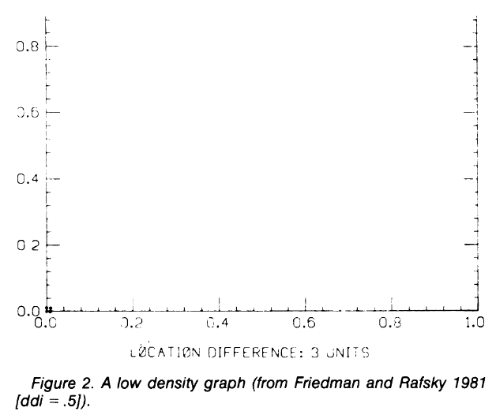
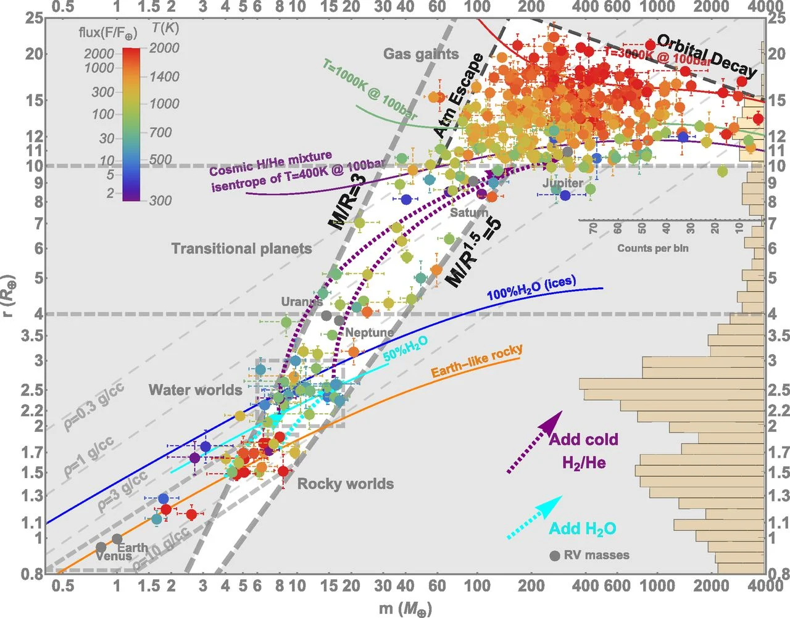
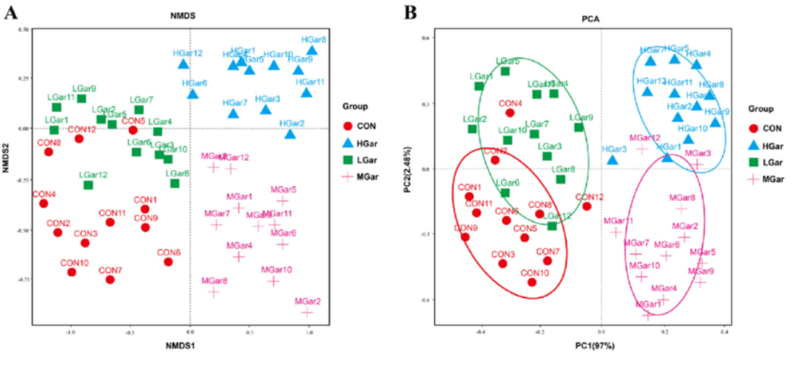
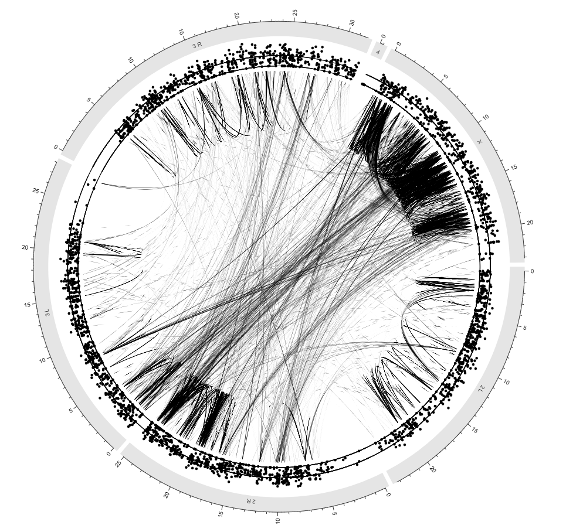
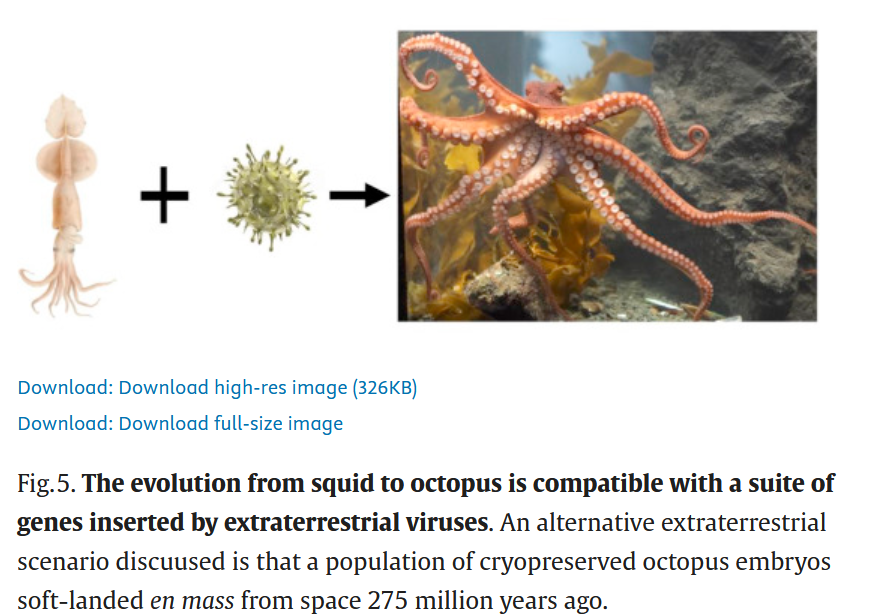

# Data Visualization for Genomics

## What this lecture will cover

We'll look at some common examples of genomic data presentation.

. . .

The source code (this time in `R`) will also supply some example code of plots.

. . .

We will not cover the full gamut of data visualization theory.

. . .

A good book on that is Claus Wilke's [Fundamental's of Data Visualization](https://clauswilke.com/dataviz/)

## Some general pointers {.smaller}

There are many aspects of data visualization that are *aesthetic* choices - therefore they are largely subjective.

. . .

There are some aspects, however, that are not purely subjective, but may mislead/misinform the reader: these you should avoid when possible.

. . .

At the end of the day, however, your data is telling a *story*. Figures, like models, are simplifications of the data. What you plot implicitly assumes what you didn't plot does not matter.

. . .

Be clear about what you are displaying and why, and make replicating your work as easy as possible, and as a result you can take some more liberties in what aspects you decide to plot vs not.

## Biggest tip {.smaller}

DON'T STOP AT THE DEFAULT PLOT!

. . .

Many packages make it easy to plot their data by including convencience functions.

. . .

Use these for data exploration, and getting a general idea for what the data shows. Do not copy these plots directly into your manuscript.

. . .

The aesthetic choices are often based on their example data/defaults in R - these might not be right for your data.

. . .

Your readers and reviewers *will* clock a default plot from a mile away, and in a subtle way it will make them doubt your skills.

. . .

The defaults just plain look bad!

## What is considered bad changes

3-4 decades ago, one major piece of advice on figures was to keep the "data density" high - put as much data into each plot as possible.

. . .

We now tend to advise people to decrease visual clutter in graphs by being selective about which aspects of data to plot - not every statistic deserves a main figure.

## Low data density



## High data density

{width="726"}

[@Zeng2019]

## Why genomic data visualization is complicated {.smaller}

One reason you will have to spend more time thinking about how to best visualize data in genomics than, say, chemistry, is that most of our data is highly hierarchically structured.

. . .

This includes both distance across the genome, but also similarities between populations/species, relationships between different statistics that need to be compared side-by-side, etc.

## Starting from the forest

As you begin any project in population genetics, often the first step is to account for population structure.

. . .

We've shown you before how to plot a PCA, but it's often useful to plot that PCA including colors based on the inferred clustering/structure.

. . .

It's often to choose a color scheme early and define it at the start of your project - this will let you have one place to change it as you need to update different aspects of the project.

## Today's example data - *D. melanogaster*

Today, we'll use some *D. melanogaster* data.

. . .

Three major clusters - southeastern Africa (AFR1), the rest of Africa (AFR2), and cosmopolitan (OOA).

. . .

Many small subsets within. Color scheme should ideally let anyone visually identify the major clusters *and* distinguish within the rest.

## Defining our color scheme

```{r}
#| echo: true
library(ggplot2)
library(cowplot)
library(scales)
theme_set(theme_cowplot())

cols_3 = c("AFR1"="red2","AFR2"="purple2","OOA"="royalblue2")
show_col(cols_3,ncol=3)
cols_5 = c("East"="purple2","West"="mediumpurple","OOA"="royalblue2","South"="red2","ET"="turquoise4")
cols_14 = c("OOA_1-anc10"="royalblue2",
            "OOA_2-anc5"="navyblue",
            "OOA_minor_1-anc11"="steelblue",
            "OOA_minor_2-anc12"="steelblue2",
            "OOA_minor_3-anc6"="steelblue3",
            "Beijing-anc14"="skyblue",
            "South_1-anc13"="red2",
            "South_2-anc2"="tomato",
            "South_minor_1-anc8"="tomato3",
            "South_minor_2-anc9"="tomato4",
            "HD-anc1"="seagreen",
            "Ethiopia-anc7"="turquoise4",
            "East-anc4"="purple2",
            "West-anc3"="mediumpurple"
            )
show_col(cols_14,ncol=14)
```

## Notes on PCA

Here, I'll have pre-computed the PCA outside of R.

. . .

Often a good idea, since the data-set could be quite huge.

## PCA default vs custom

```{r}
library(readr)
eigenvecs = read_table("data/dmel.eigenvec")
eigenvals = read_table("data/dmel.eigenval")
eigenvals = round((eigenvals[,1]/sum(eigenvals[,1]))*100,2)
samples_table = read_csv("data/dmel_table.csv")

#Factor ancestries in order of plotting
samples_table$K3 = factor(samples_table$K3,levels=c("AFR1","AFR2","OOA"))

samples_table$K14 = factor(samples_table$K14,levels=c(
            "South_1-anc13",
            "South_2-anc2",
            "South_minor_1-anc8",
            "South_minor_2-anc9",
            "HD-anc1",
            "Ethiopia-anc7",
            "East-anc4",
            "West-anc3",
            "OOA_1-anc10",
            "OOA_2-anc5",
            "OOA_minor_1-anc11",
            "OOA_minor_2-anc12",
            "OOA_minor_3-anc6",
            "Beijing-anc14"
            ))

samples_table$PC1 = NA
samples_table$PC2 = NA
idx = match(samples_table$Sample,eigenvecs$ID2)
samples_table$PC1 = eigenvecs$PC1[idx]
samples_table$PC2 = eigenvecs$PC2[idx]

pca_plot = ggplot(samples_table,aes(x=PC1,y=PC2))+
    geom_point(aes(col=K3))+
    labs(x=paste("PC1 (",eigenvals[1,1],"%)",sep=""),y=paste("PC2 (",eigenvals[2,1],"%)",sep=""),col="Major Ancestry")

plot_grid(pca_plot,pca_plot+scale_color_manual(values=cols_3,na.value=rgb(0,0,0,alpha=0.1)))
```

## Other good ideas

It can be worth your time to rescale the axes to their relative contributions. In this case, the figure should be \~3x as wide as it is tall, so that visually the PCs match their variance explained ratios.

## Example

```{r}
#| fig-height: 4
#| fig-width: 12
pca_plot+scale_color_manual(values=cols_3,na.value = rgb(0,0,0,alpha=0.1))+theme(legend.position=c(0.9,0.7),legend.text=element_text(size=12),legend.title=element_text(size=12))
```

## Color choices for more groups

```{r}
#| fig-height: 5
#| fig-width: 10
pca_plot2 = ggplot(samples_table,aes(x=PC1,y=PC2))+
    geom_point(aes(col=K14))+
    labs(x=paste("PC1 (",eigenvals[1,1],"%)",sep=""),y=paste("PC2 (",eigenvals[2,1],"%)",sep=""),col="Major Ancestry")+
    scale_color_manual(values=cols_14,na.value = rgb(0,0,0,alpha=0.1))
pca_plot2
```

## Double-code!

```{r}
#| fig-height: 5
#| fig-width: 10
shapes_14 = c("OOA_1-anc10"="square",
            "OOA_2-anc5"="square open",
            "OOA_minor_1-anc11"="square cross",
            "OOA_minor_2-anc12"="square plus",
            "OOA_minor_3-anc6"="square triangle",
            "Beijing-anc14"="triangle down open",
            "South_1-anc13"="circle",
            "South_2-anc2"="circle open",
            "South_minor_1-anc8"="circle cross",
            "South_minor_2-anc9"="circle plus",
            "HD-anc1"="asterisk",
            "Ethiopia-anc7"="diamond",
            "East-anc4"="diamond open",
            "West-anc3"="diamond plus"
            )

pca_plot2 = ggplot(samples_table,aes(x=PC1,y=PC2,col=K14,shape=K14))+
    geom_point()+
    labs(x=paste("PC1 (",eigenvals[1,1],"%)",sep=""),y=paste("PC2 (",eigenvals[2,1],"%)",sep=""),col="Major Ancestry",shape="Major Ancestry")+
    scale_color_manual(values=cols_14,na.value = rgb(0,0,0,alpha=0.1))+
    scale_shape_manual(values=shapes_14,na.value="plus")

pca_plot2
```

## More PCs?

```{r}
#| fig_width: 15
#| fig_height: 4
samples_table$PC3 = NA
samples_table$PC4 = NA
samples_table$PC3 = eigenvecs$PC3[idx]
samples_table$PC4 = eigenvecs$PC4[idx]

pca_plot34 = ggplot(samples_table,aes(x=PC3,y=PC4))+
    geom_point(aes(col=K14,shape=K14))+
    labs(x=paste("PC3 (",eigenvals[3,1],"%)",sep=""),y=paste("PC4 (",eigenvals[4,1],"%)",sep=""),col="Major Ancestry",shape="Major Ancestry")+
    scale_color_manual(values=cols_14,na.value = rgb(0,0,0,alpha=0.1))+
    scale_shape_manual(values=shapes_14,na.value="plus")

plots = plot_grid(pca_plot2+theme(legend.position="none"),pca_plot34+theme(legend.position="none"),rel_heights=c(1,2/3),nrow=2)

legend2=get_legend(pca_plot34)

plot_grid(plots,legend2,rel_widths=c(1,0.25))

```

## 3D plots - avoid

It may be tempting to tie across dimensions by plotting in 3D. This can work in rare cases.

. . .

Generally - some points will be hidden/distances will be less clear in 3D.

. . .

Often, 3D plots also show up poorly in print.

. . .

Great for presentations/interactive data!

## Plot3d Example

```{r}
library(plotly)
fig = plot_ly(samples_table,x=~PC1*42,y=~PC2*15,z=~PC3*8,color=~K14,colors=cols_14)
fig <- fig %>% add_markers()
fig <- fig %>% layout(scene=list(xaxis=list(title="PC1"),
    yaxis = list(title = 'PC2'),
    zaxis = list(title = 'PC3')))
fig
```

## PCA alternatives {.smaller}

You will often encounter plots that *look* like PCA, but are not PCA.

. . .

It's good to know what each is and what they are used for:

## PCoA

Principle Coordinate Analysis - calculate distances between all samples across all measured variables and collapse distance matrix to lower dimension. Output axes represent how much distance between samples is explained along that axis.

## Example

```{r}
#| results: hide
library(vcfR)
vcf=read.vcfR("data/dmel_thin.vcf.gz")
gt = extract.gt(vcf,element="GT",as.numeric=TRUE)
inds = gsub("0_","",colnames(gt))
pops = pops14=samples_table$K14[match(inds,samples_table$Sample)]
pops14[which(is.na(pops14))] = "South_1-anc13"
gt = t(as.matrix(apply(gt,1,function(x){tmp=x;tmp[which(is.na(x))] = mean(x,na.rm=TRUE);return(tmp)})))
dist_mat = dist(t(gt))
pcoa = princomp(as.matrix(dist_mat))
pcoa$sdev = pcoa$sdev/sum(pcoa$sdev)
pco_plot=ggplot()+geom_point(aes(x=pcoa$scores[,1],y=pcoa$scores[,2],col=pops14,shape=pops14))+scale_color_manual(values=cols_14)+scale_shape_manual(values=shapes_14)+theme(legend.position="none")+
labs(x=paste("PCoA 1 (",round(pcoa$sdev[1]*100,2),"%)",sep=""),
y=paste("PCoA 2 (",round(pcoa$sdev[2]*100,2),"%)",sep=""))

plot_grid(pca_plot2+theme(legend.position="none"),pco_plot)
```

## DAPC

Discriminant analysis of PCs: pre-defined groups are as separated in space as possible. Output axes represent how differentiated different groups are.

## Example 
```{r}
#| results: hide
library(adegenet)
dapc_dmel = dapc(t(gt),pops14,n.pca=15,n.da=2)
scatter(dapc_dmel)
```

## NMDS

Non-metric Multidimensional Scaling: Similar to PCoA, but based on rank of distances. Output axes are arbitrary and have *no* meaning.

## Example



## t-SNE

t-distributed stochastic neighbor embedding: similar objects are placed near each other probabilistically. Placement varies by run, axes have no meaning, and some methods allow for pre-defined clusters being placed closer to each other.

. . . 

Optimal when there are many groups, you have equal sampling for each group and you mainly want to display that they do cluster next to each other, but distances between groups don't matter.

## Example
```{r}
#| results: hide
library(Rtsne)
tsne_res = Rtsne(unique(t(gt)),dims=2,perplexity=40,initial_dims=20,vecbose=TRUE,max_iter=2000)
idx = which(duplicated(t(gt)))
ggplot()+geom_point(aes(x=tsne_res$Y[,1],tsne_res$Y[,2],col=pops14[-idx],shape=pops14[-idx]))+scale_color_manual(values=cols_14)+scale_shape_manual(values=shapes_14)+theme_void()
```

## So, which to use?

Depends on your data and what you want to show:

- PCA for how variation is partitioned

- PCoA for how differences are distributed

- NMDS when data doesn't meet PCA assumptions

- t-SNE when data highly multi-dimensional _and_ there are many true clusters, but you don't need axes to mean anything (and distances between groups are arbitrary)

## STRUCTURE - best in context

It's often tempting to just plot STRUCTURE results.

. . .

Keep in mind that this may make the data seem either chaotic (as its ordered relatively arbitrarily), or highly structured when individuals are grouped by similarity.

. . .

Often good to plot next to a phylogeny showing relationships between samples.

## *D. melanogaster* structure

```{r}
library(popkin)
q_matrix = read_table("data/dmel_ancestry.K14.Q")[,1:15]
names(q_matrix)[1] = "Sample"
order_anc = c(6,8,14,15,2,13,10,9,3,11,4,5,12,7)
plot_admix(q_matrix[,order_anc],col=cols_14)
```

## Better - along tree

```{r}
#| fig-width: 15
#| fig-height: 10
library(ggtree)
library(phytools)
library(reshape2)
tree=read.tree("data/dmel_consensus.newick")
tree = root.phylo(tree,outgroup="w501")
tree2 = drop.tip(tree,setdiff(tree$tip.label,q_matrix$Sample))

tree_plot = ggtree(tree2)
q_matrix_long = melt(q_matrix)
tree_plot = tree_plot %<+% samples_table + geom_tiplab(aes(color=Sampling.Locale),size=2) +
    scale_color_manual(values=cols_5) +
    geom_facet(panel="Structure",data=q_matrix_long,geom=geom_col,aes(x=value,fill=variable),col=NA,orientation="y")+scale_fill_manual(values=cols_14)

tree_plot
```

## Different layout - harder

```{r}
tree_plot2 = ggtree(tree2,layout="circular")
tree_plot2 = tree_plot2 %<+% samples_table + geom_tiplab2(aes(color=Sampling.Locale),size=2) +
    scale_color_manual(values=cols_5) +
    geom_facet(panel="Structure",data=q_matrix_long,geom=geom_col,aes(x=value,fill=variable),col=NA,orientation="y")+scale_fill_manual(values=cols_14)

tree_plot2

```

## Visualizing structure across space

You saw examples of these plots in lab last week, but we can then look at *where* structure is distributed across space.

. . .

Generally a good idea to do this for small numbers of $K$ - large number of colors can be quite difficult to distinguish.

. . .

Let's look at *D. melanogaster* data.

## *D. melanogaster* in space

```{r}
#| warning: false
#| message: false
#| echo: false
#| results: hide
library(tess3r)
idx = match(q_matrix$Sample,samples_table$Sample)
long = samples_table$Longitude[idx]
lat = samples_table$Latitude[idx]
q_matrix = q_matrix[which(is.finite(idx)),]
coordinates = as.matrix(cbind(long,lat))[which(is.finite(idx)),]
admix = as.matrix(q_matrix[,2:15])
class(admix) = "tess3Q"
my.palette = CreatePalette(cols_14[names(q_matrix[,2:15])],9)
plot(admix,coordinates,method="map.max",cex-0.2,interpol=FieldsKrigModel(10),col.palette=my.palette,resolution=c(1000,1000))
```

## Big takeaways from structure and PCA

Color choice matters - define palettes to make your code usable.

. . .

Be careful when $K$ is large! Hard to choose distinctive color sets.

. . .

Embrace hierarchical nature of populations - find similarities between groups.

## Looking across the genome

As you visualize statistics across the genome, it's good to include the relative locations of sites as part of the information.

. . .

Raw distributions of, say, $\pi$ can be useful when comparing between species/populations, but often good to see how they vary across the genome.

## Manhattan plots

Manhattan plots are standard approach here: the X-axis is location in genome, with chromosomes strung together front to back, and the Y-axis is whatever statistic you are interested in.

. . .

Most packages have their own implementation of this, but good to know how to do manually.

## Option 1: Facets

The first option is to use `ggplot`s faceting option to plot each chromosome as a facet, and just plot them in a single row with no space between facets

. . .

Biggest benefit is that any `loess` or similar curves you plot are plotted per chromosome, rather than fitting one curve for whole genome.

## Option 1: *D. melanogaster*

```{r}
pi_dxy = read_table("data/pi_dxy.txt")
#Plink loves to convert X to human numbers...
pi_dxy$chr[which(pi_dxy$chr=="23")] = "chrX"

pi_plot=ggplot(subset(pi_dxy,metric=="pi"),aes(x=(start+end)/2000000,y=value,col=pop1))+
geom_point(size=0.1)+
geom_smooth(method="loess",fill=NA,aes(group=pop1),col="white",size=2)+
geom_smooth(method="loess",fill=NA)+
facet_grid(~chr,space="free_x",scale="free_x")+
scale_color_manual(values=cols_3)+
labs(x="Position (Mb)",y="Pi",col="Ancestry")
pi_plot
```

## Option 2: Recode positions

Using something like `dplyr`, you can group the chromosomes together first, and then create a position column that is the bp of each site + total bp up to that point.

. . .

Can be more finicky, but produces generally nicer looking plots.

. . .

But, plotting anything like `geom_smooth()` you have to be super careful to not plot across whole genome.

## Secret third option

`Circos` plots arrange the genome in a circle.

. . .

Horrible for actual comparisons (inner axes squinched, axes labels unreadable, etc.)

. . .

Great for visualizing *interactions* (LD, epistasis, etc.)

## Circos in *D. melanogaster*

{width="740"}

## Color choice for genomic plots

Some aspects of the plots are easy to keep consistent with your chosen color scheme ($\pi$ or demographic history per population can just use the pre-defined scheme).

. . .

Pairwise comparisons are more difficult - this is why we've saved some primary colors when defining our base scheme.

. . .

You won't have a unique color for everything (in our *D. melanogaster* data: $14$ pops, so $105$ colors for a unique sheme).

. . .

Remember that your figures are meant to both display the overall data *and* tell a story.

## Solution 1: choose focal species, color by second

```{r}
ggplot(subset(pi_dxy,metric=="Dxy" & pop1=="OOA"),aes(x=(start+end)/2000000,y=value,col=pop2))+
geom_point(size=0.1)+
geom_smooth()+
facet_grid(~chr,space="free_x",scale="free_x")+
scale_color_manual(values=cols_3)+
labs(x="Position (Mb)",y="Dxy with OOA",col="Ancestry")

```

## Solution 2: new colors entirely

```{r}
pi_dxy$pair = apply(pi_dxy,1,function(x) paste(sort(c(x[4],x[5])),collapse="-"))

cols_3_pair = c("AFR1-AFR2"="darkgoldenrod2","AFR1-OOA"="limegreen","AFR2-OOA"="mediumaquamarine")

ggplot(subset(pi_dxy,metric=="Dxy"),aes(x=(start+end)/2000000,y=value,col=pair))+
geom_point(size=0.1)+
geom_smooth()+
facet_grid(~chr,space="free_x",scale="free_x")+
scale_color_manual(values=cols_3_pair)+
labs(x="Position (Mb)",y="Dxy",col="Ancestry")
```

## Minor tip

When plotting a curve over a cloud of points, it's often hard to see the confidence interval/the curve itself.

. . .

Simple fix: remove confidence interval, plot the same curve first as a thick white line.

## Example

```{r}
dxy_plot=ggplot(subset(pi_dxy,metric=="Dxy"),aes(x=(start+end)/2000000,y=value,col=pair))+
geom_point(size=0.1)+
geom_smooth(aes(group=pair),fill=NA,col="white",size=2)+
geom_smooth(fill=NA)+
facet_grid(~chr,space="free_x",scale="free_x")+
scale_color_manual(values=cols_3_pair)+
labs(x="Position (Mb)",y="Dxy",col="Ancestry")
dxy_plot
```

## Alternative - lighter conf int

```{r}
ggplot(subset(pi_dxy,metric=="Dxy"),aes(x=(start+end)/2000000,y=value,col=pair))+
geom_point(size=0.1)+
geom_smooth(fill=rgb(1,1,1,alpha=1))+
facet_grid(~chr,space="free_x",scale="free_x")+
scale_color_manual(values=cols_3_pair)+
labs(x="Position (Mb)",y="Dxy",col="Ancestry")
```

## Manhattan plots and log scales

You may sometimes have data points that are distant outliers to most of the data.

. . . 

Using a log-scale for the Y can be tempting here, but be careful!

. . . 

Often, Manhattan plots show the results of something like a GWAS, and the Y-axis is therefore a $-log(p-val)$. This is fine.

. . . 

Any time the Y axis is a ratio of something, log scale is also better.

## Example

```{r}
pi_OOA = subset(pi_dxy,metric=="pi" & pop1=="OOA")
pi_AFR1 = subset(pi_dxy,metric=="pi" & pop1=="AFR1")
pi_AFR2 = subset(pi_dxy,metric=="pi" & pop1=="AFR2")
pi_AFR1$pi_rat1 = pi_OOA$value/pi_AFR1$value
pi_AFR1$pi_rat2 = pi_AFR2$value/pi_AFR2$value

non_log_plot = ggplot(pi_AFR1,aes(x=pi_AFR1$start/1000000,y=pi_rat1))+geom_point(size=0.1,col=cols_3["OOA"])+geom_smooth(col="white",fill=NA,size=2)+geom_smooth(col=cols_3["OOA"],fill=NA)+facet_grid(~chr,space="free_x",scale="free_x")+labs(x="Position(Mb)",y="pi_OOA/pi_AFR1")

log_plot = non_log_plot+scale_y_continuous(trans="log10")

plot_grid(non_log_plot,log_plot)
```

## Other genomic standards

JBrowse - great for visualizing features along a genome (genes,TEs,series of statistics) in a single platform. Not great for running from R, but own data format is very simple to adapt to.

. . . 

Volcano plots - visualizing excess of p-values vs effect sizes, often for expression data. Really just a scatter plot, but with some own conventions.

. . . 

GO enrichment plots - various libraries and approaches, I suggest looking at `GOSemSim` for fairly good standards for GO enrichment plots.

. . . 

Distributions of data have surprisingly no standards: boxplots, violins, ridgelines, hexbins, histograms, etc. Each depends on specific shape of distribution and goal of plot (comparison, description,highlighting outliers, etc.)


## Some practical details

Often, you will not be satisfied with the end result of your figure fully.

. . .

Minor edits, changing layouts, adding details *are* useful, but be careful about how much you do outside of `R`/other programming language.

. . .

Your workflow needs to be rapidly repeatable!

. . . 

Some helper packages: `ggpubr`, `ggextras` add functions that make certain elements closer to publication ready graphics. 

## Complex plots

Functions like `plot_grid` from `cowplot` let you create quite complex layouts (or the whole `patchworks` package)

. . .

Grammar of graphics (the background philosophy behind `ggplot2`) deals with images as layers - build up complex figures slowly.

. . .

You can take multiple different figures you've made and add them in various sizings, with automatic panel labels, etc.

## Example

```{r}
#Column 1
row_1 = plot_grid(pca_plot2+theme(legend.position="none"),pca_plot34+theme(legend.position="none"),rel_widths=c(1,1),labels=c("A","B"))
row_2 = plot_grid(pi_plot+theme(legend.position="none",axis.title.x=element_blank()),dxy_plot+theme(legend.position="none",strip.background=element_blank(),strip.text.x=element_blank()),nrow=2,labels=c("C","D"),align="v",axis="b")
col_2 = tree_plot+theme(legend.position="none")

col_1 = plot_grid(row_1,row_2,ncol=1,rel_heights=c(0.3,0.66))

full_plot = plot_grid(col_1,col_2,ncol=2,labels=c("","E"),rel_widths=c(1,0.66))

full_plot
```

## Very Busy!

Lots of twiddling to get to the right point.

. . .

Controversial: remove axes labels that will not be readable in real figures.

. . .

Adjust text size so the bits that matter are readable.

. . .

Submit full versions in the supplement.

## E.g.

```{r}
#Column 1
row_1 = plot_grid(pca_plot2+theme(legend.position="none",axis.text.x=element_blank(),axis.text.y=element_blank()),pca_plot34+theme(legend.position="none",axis.text.x=element_blank(),axis.text.y=element_blank()),rel_widths=c(1,1),labels=c("A","B"))

row_2 = plot_grid(pi_plot+theme(legend.position="none",axis.title.x=element_blank(),axis.ticks.x=element_blank(),axis.text.x=element_blank(),strip.background=element_rect(fill="white"),panel.spacing=unit(0,"lines")),
dxy_plot+theme(legend.position="none",strip.background=element_blank(),strip.text.x=element_blank(),panel.spacing=unit(0,"lines"),axis.ticks.x=element_blank(),axis.text.x=element_blank()),nrow=2,labels=c("C","D"),align="v",axis="b")

col_2 = tree_plot+theme(legend.position="none",strip.background=element_rect(fill="white"))

col_1 = plot_grid(row_1,row_2,ncol=1,rel_heights=c(0.3,0.66))

full_plot = plot_grid(col_1,col_2,ncol=2,labels=c("","E"),rel_widths=c(1,0.66))

full_plot
```

## No figure is really perfect!

Don't keep twiddling on the figures endlessly!

. . .

At some point, the data is displayed clearly, there are few distractions, and so you are good to go.

. . .

## If this got published so can you

{width="640"}

## Thursday - Figure critiques

Instead of reading, either bring in your own figure, or find a figure in a paper that you like.

. . .

We'll spend some time thinking about how the relevant data could have been portrayed better, and what aspects of the figure can be changed for the better.

. . .

If you have your own data - treat this as an opportunity to get feedback on presentation.

. . .

If you don't - treat this as an opportunity to see how your favorite plots can be improved.